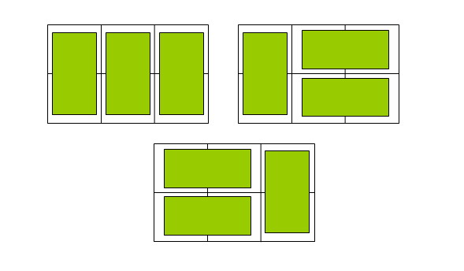

# 题目描述

在2×n的一个长方形方格中,用一个1× 2的骨牌铺满方格,输入n ,输出铺放方案的总数.

例如n=3时,为2× 3方格，骨牌的铺放方案有三种,如下图：

# 输入

输入数据由多行组成，每行包含一个整数n，表示该测试实例的长方形方格的规格是2×n (1≤n≤90)。

# 输出

对于每个测试实例，请输出铺放方案的总数，每个实例的输出占一行。

# 样例输入

1
3
2

# 样例输出

1
3
2
